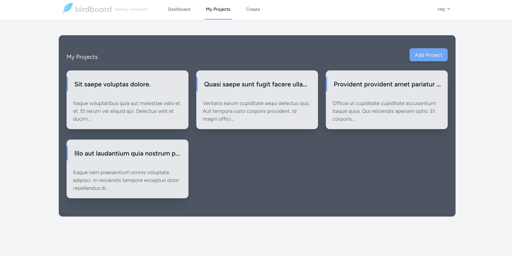
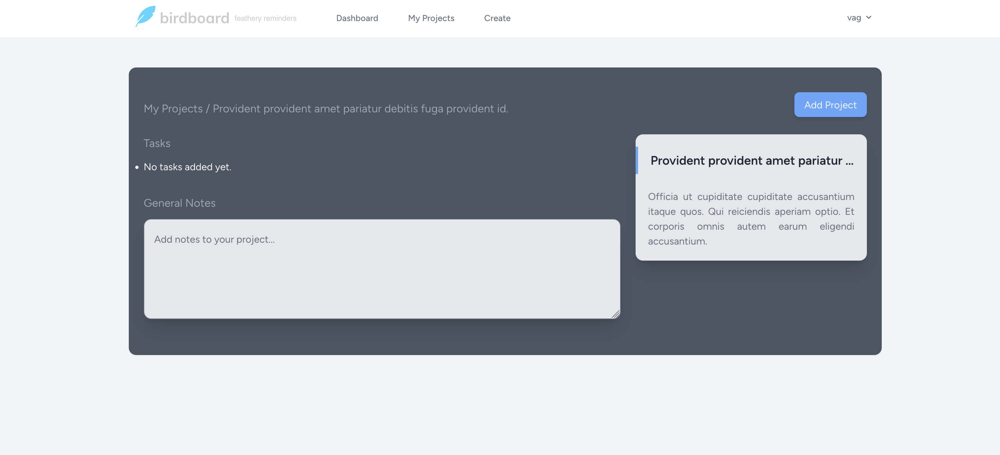
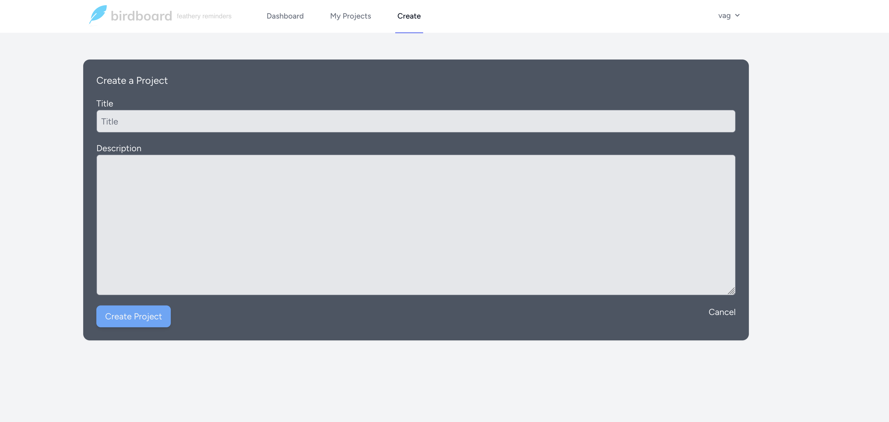

# Birdboard Project 

## Overview

The Birdboard Project is a Laravel-based application designed for developing built-in with TDD (Test Driven Development). The technology stack includes Laravel for backend functionality, HTML, CSS Tawilind, for frontend interactivity, and MySQL for database management.

Clone the repository:

    git clone https://github.com/your-username/birdboard.git
    cd birdboard
    
Install Composer dependencies:

    composer install
    

Install NPM dependencies:

    npm install

Update the `.env` file with your database configuration
    
    env.example .env
 
Run Migrations and Seed Database

    php artisan migrate --seed

Run the dev server

    npm run dev

## Screenshots

The User Dashboard

## Project Progress

  - The project is actively being developed, with updates and improvements added regularly.
  - Daily updates will include additional images and descriptions.

## Customization

  - Feel free to download the project and make any amendments based on your requirements.

## License

  - This project is licensed under the [MIT License](LICENSE).
